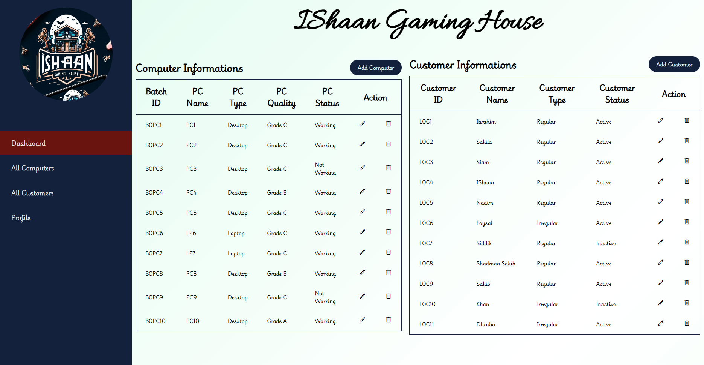

#Web Dev Lab Project
## I have created this project to submit as my web dev lab project

some instructions to use this project 
1. use inventory.sql to ge the database
    -> It measns If you want the project fully working then you nee dto setup database by following these process
     -> open phpmyadmin
     -> create a new database named inventory
     -> import the inventory.sql file into the database
2. open the project in a code editor
3. run the project on a local server like xampp or wampp
4. open the project in a browser by typing localhost/projectname
5. you can login as admin using username: ibrahim and password: password
6. you can add, edit, delete computer info's and customer info's

Now you can proceed. 

THANK YOU

Now some update info:
    I will update this project further eventurally will fine all the necessery updates in my github profile: https://github.com/ibrahimshaan0 

There are some UI examples:

